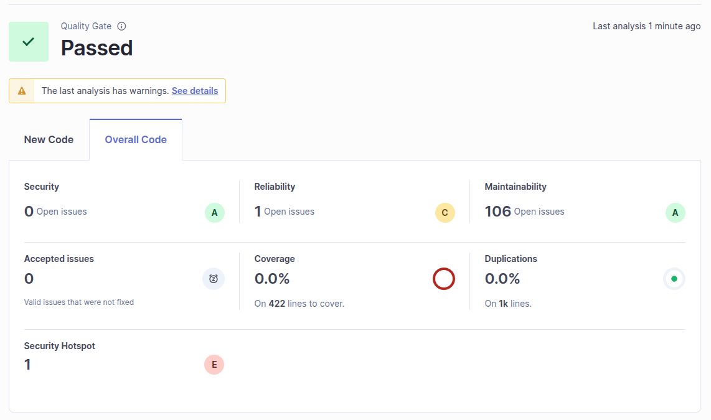
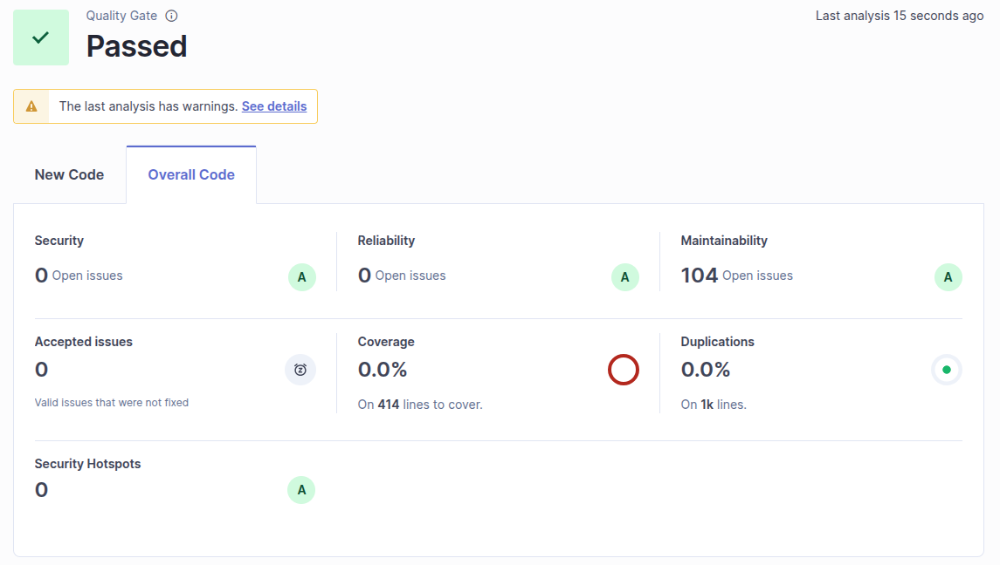

# Exercice 4

Voici le rapport SonarQube sur le projet java `BankApplication`.


1.
Dans la classe BankAccount, il y a une 'reliabilty issue' à la ligne 163 :
> A "NullPointerException" could be thrown; "fileScanner" is nullable here.

```java
while (fileScanner.hasNextLine())
```

Ici la variable `fileScanner` peut être `null` car elle n'est pas initialisé avant de lancer `hasNextLine`.

Pour regler ce problème :
Il faut initialiser la variable.

2.
Dans la classe BankAccountApp, il a une 'security hotspot' à la ligne 80 :
`Make sure this debug feature is deactivated before delivering the code in production.`

```java
e.printStackTrace();
```

Cette fonction de débug doit être désactivé avant de livrer le logiciel en production afin d'éviter une quelconque fuite de donnée.

Pour regler ce probleme :
Il suffit de supprimer cette ligne.

3.
Dans la classe Bank, il y a une 'maintainability issue' à la ligne 24 :
`This block of commented-out lines of code should be removed.`

```java
// private double minumumBalance;
```

On essaye de ne pas laisser de code mort, même commenté, au sein du projet.

Pour regler ce probleme :
Il suffit de supprimer cette ligne.



Comme on peut le voir les différentes erreurs ont été reglées et n'apparaissent plus dans le rapport SonarQube.


