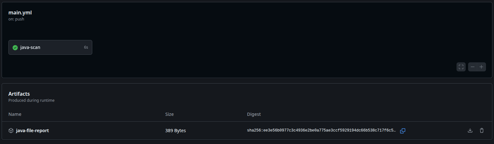

# Exercice 5

Dans le repository on crée un fichier .yml dans le dossier `.github/workflows/` contenant le script de notre action.
Suite à l'exécution du workflow, on peut accéder au compte rendu via l'artefact que l'on a produit.


Contenue de l'artifact : 
```
Java File Report
================

Per-file breakdown:
src/main/java/bankAccountApp/ACHService.java – 25
src/main/java/bankAccountApp/ACHServiceImpl.java – 19
src/main/java/bankAccountApp/Bank.java – 202
src/main/java/bankAccountApp/BankAccount.java – 215
src/main/java/bankAccountApp/BankAccountApp.java – 220
src/main/java/bankAccountApp/Person.java – 273
src/test/java/bankAccountApp/ACHServiceTest.java – 58
src/test/java/bankAccountApp/AllTests.java – 11
src/test/java/bankAccountApp/BankAccountTest.java – 205
src/test/java/bankAccountApp/BankTest.java – 148
src/test/java/bankAccountApp/PersonTest.java – 228

Summary:
Number of .java files: 11
Total lines of code: 1604
```